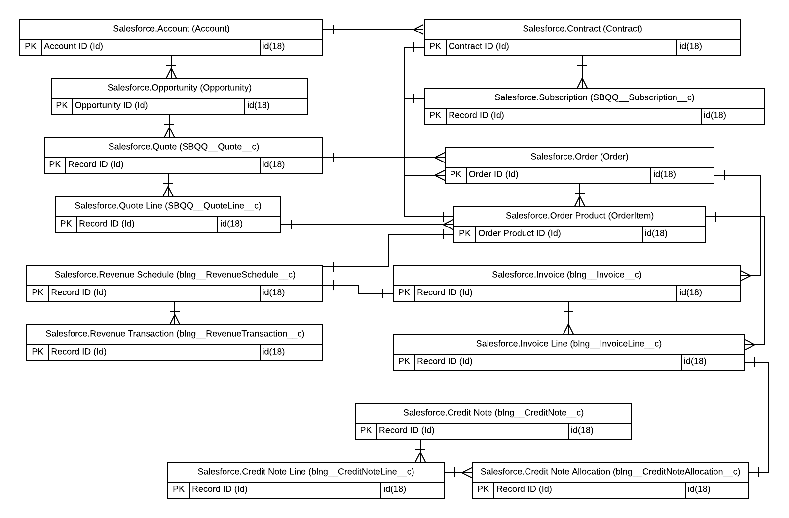
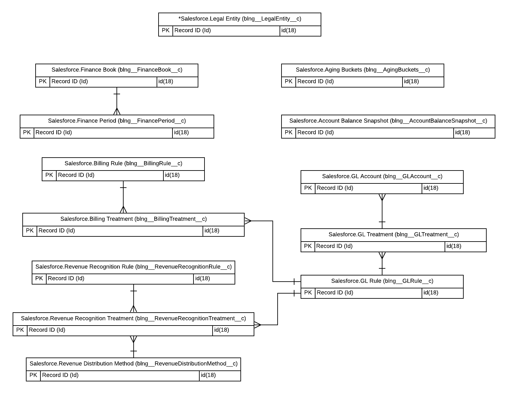
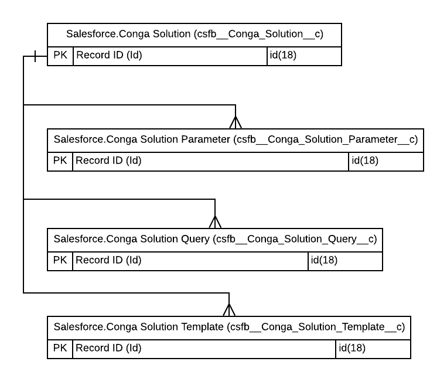

# Advanced Billing Specialist
* Trailheadのスーパーバッジ、[Advanced Billing Specialist](https://trailhead.salesforce.com/content/learn/superbadges/superbadge_advanced_billing_specialist) の日本語訳(**非公式**)です。
* 各カスタマイズ要素のラベル部分には補足として日本語を括弧内に記載している場合がありますが、正解チェックは英語のラベルを元に行われるため、実際のチャレンジには日本語表記を含めず、英語表記のみを使用して行って下さい。また、チャレンジ前にユーザと組織の言語・ロケールを英語に切り替えておくことを推奨します。

## このスーパーバッジを取得するためにすること
* Salesforce CPQ, Billing, CIG を備えた Developer Edition 組織のサインアップ
* UMS の US 法人レコードの作成と商談商品の自動化
* UMS の US 財務期間と財務帳簿の作成 (会計と収益)
* 総勘定元帳の情報で Salesforce Billing のトランザクションを向上させる
* 請求書の振る舞いを制御するために請求ルールと請求処理を設定する
* Major Solar Panel の1回限りの商品およびサブスクリプション商品に対して、完全および按分の収益認識を設定する
* 口座残高スナップショットを生成しカスタムの請求レポートを作成することで口座残高情報を評価する
* 自動化プロセスを作成して、未払いの請求書残高を顧客に警告する
* Conga Invoice Generation を用いて、UMS の現在の請求書を改善する
* 契約の修正を通した Cloud Kicks のアップセル
* 知識のチェック (クイズ)

## このスーパーバッジでテストする概念
* Salesforce Billing の設定アプリケーションを使用してダウンストリームの記録管理をサポートする
* 収益認識を設定して完全および按分の商品要件をサポートする
* プロセスビルダーの自動化を使用して法人レコードの入力を自動化する
* 得意客に対する注文の修正と取り消しを処理する
* CIG を使用して顧客への請求書を提示し発行する
* 口座残高スナップショットを生成しカスタムの請求レポートを作成する
* ベストプラクティスに従い請求書を修正し調整する
* Cloud Kicks に対して契約の修正を実施する
* 知識のチェック (クイズ)

## 事前準備とメモ
### Salesforce Billing と Salesforce CPQ を備えるDeveloper Edition 組織の作成
このスーパーバッジを完了するには、Salesforce CPQ、Salesforce Billing、Conga Invoice Generation、サンプルデータを含む特別なDeveloper Edition 組織が必要です。無料のDeveloper Edition を入手してTrailhead に接続すると、このスーパーバッジのChallenge を完了することができます。

特別に Saleseforce Billing が有効化された Developer Edition 組織に最近サインアップした場合でも、このスーパーバッジのために新しい組織にサインアップしてください。常に新しいデータが追加されています。また、管理パッケージは90日後に期限切れになるため、新しい組織が必要になる場合があることにも注意してください。

* [Salesforce Billing および Salesforce CPQ を備える無料のDeveloper Edition 組織](https://developer.salesforce.com/promotions/orgs/advbillingspecialist)にサインアップします。
* フォームに入力します。Email の欄には、有効な電子メールアドレスを入力します。Username の欄には、メールアドレス形式の一意のユーザー名を入力しますが、有効な電子メールアカウントと一致している必要はありません。(例: yourname@billingcpq4ever.com) 
* フォームに入力したら、**Sign Me Up**  (サインアップ) をクリックします。確認メッセージが表示されます。
* ようこそメールを受信 (数分かかる場合があります) したら、それを開き、**Verify Account** (アカウントを確認) をクリックします。
* パスワードと秘密の質問を設定して、登録を完了します。**ポイント**: 後で簡単にアクセスできるように、ユーザー名、パスワード、およびログインURLを書き留めます。
* Developer Edition にログインされた状態になります。
* 次に、新しい Developer Edition 組織をTrailhead に接続します。
* Trailhead アカウントにログインしていることを確認してください。
* このページの下部にある **Challenge** セクションで、選択リストから **Log into a Developer Edition** (Developer Edition にログイン) を選択します。
* ログイン画面で、先ほど設定した Developer Edition のユーザー名とパスワードを入力します。
* Allow Access? (アクセスを許可しますか？) の画面で、**Allow** (許可) をクリックします。
* Want to connect this org for hands-on challenges? (この組織をハンズオンの Challenge 用に保存しますか?) の画面で、**Yes! Save it** (はい、保存します) をクリックします。Challenge のページにリダイレクトされ、新しいDeveloper Edition を使用してこのスーパーバッジを獲得する準備が整います。
* 専用の管理パッケージがインストールおよび有効化されたSalesforce 組織ができたので、準備完了です。

ペンと紙を準備して、要件を読み進める際にメモを取ってください。

* リリースを確実に成功させるため、要件ドキュメントに指定される命名規則を利用してください。
* デフォルトの通貨は USD で、デフォルトのタイムゾーンは PST です。これらは日付とスケジューラに必要です。
* このスーパーバッジで利用される用語のいくつかは、UIに表示される設定上の名称と完全に一致しない場合があります。これは、Salesforce の機能に関する知識と、ビジネス上のニーズを満たす正しい機能を選択する能力をテストするためです。
* Advanced Billing Specialist Superbadge は、Billing Specialist Superbadge の続きであり、同じユースケースに基づいて構築することを目的としていますが、それぞれは互いに独立しています。両方に同様のストーリーラインが含まれていますが、スーパーバッジの各 Challenge に合格するには、別々の開発組織を用意する必要があります。
* 最後の Challenge 用に、商談と見積レコード (Q-00007) があらかじめ作成されています。これらのレコードを事前に使用しないでください。使用すると、Challenge が失敗する可能性があります。
* **ポイント**: メタデータおよびレコードデータを設定するために示されている値は手動で入力せず、コピー・ペーストしてください。これにより、Challenge の失敗を引き起こすタイプミスやスペルミスの可能性が減ります。

### Conga Invoice Generation (CIG) の設定:

* CIG を使用する際は、ブラウザのポップアップブロックをオフにします。
* Conga Invoice Generation アプリケーションに移動します
* **Quick Start** タブを選択し、**Launch Quick Start** ボタンを選択します。
* **Generate Invoice** を選択します。
* サイトを追加するための確認のポップアップに従います。**Add Site** ボタンをそれぞれ選択してサイトを追加し、指示に従って別のタブで開くサイトレコードを保存し、タブを閉じます。
* 設定から Invoice オブジェクトへ移動します。
* Invoice Layout のページレイアウトを更新して Generate Invoice Lightning アクションを追加します。
* **Conga Composer Setup** タブを選択して、ポップアップウィンドウで **Allow** を選択し、Conga Composer を認証します。

#### 重要な注意事項:
Challenge を始める前に、[Advanced Billing Specialist: Trailhead Challenge Help (英語)](https://trailhead.salesforce.com/help?article=Advanced-Billing-Specialist-Superbadge-Challenge-Help)を参照してください。

## ユースケース
Ursa Major Solar, Inc. (UMS) は、1年以上前に Salesforce Billing を実装し、このソリューションを実装することで多くの利点を経験しています。Solange、James、およびその他の請求チームは、請求システムを維持するために必要な手作業の量を削減しました。チームは非常に満足しており、まだ使用していない機能の一部を実装したいと考えています。

元のソリューションの実装を支援したコンサルタントとして、彼らはあなたに連絡し、実装の第2フェーズの支援を依頼しました。UMS のステークホルダが提供する追加のビジネス要件を満たすようにシステムを構成し、Cloud Kicks の年間契約を更新する責任があります。 第2フェーズの終わりまでに、UMS は、記録管理、未処理の顧客残高の明確なビューのレポート、および顧客への請求書ドキュメントの提示と配信のためにより充実したデータを提供できるようになります。

### 主要なステークホルダ
- Weimar Williams (Chief Financial Officer)
- Lincoln Ulrich (アカウントエグゼクティブ)
- Solange Pereira (請求オペレーションスペシャリスト)
- James August (情報管理者)
- Maria Jimenez (システム管理者)

### 標準オブジェクト
- Product (商品)
- Account (取引先)
- Opportunity (商談)
- Order (注文)
- Order Product (注文商品)
- Contract (契約)

### 管理パッケージのカスタムオブジェクト - トランザクション
- Quote (見積)
- Quote Line (見積品目)
- Subscription (サブスクリプション)
- Credit Note (クレジットノート)
- Credit Note Line (クレジットノート品目)
- Credit Note Line Allocation (クレジットノート割り当て)
- Revenue Schedule (収益スケジュール)
- Revenue Transaction (収益トランザクション)

### 管理パッケージのカスタムオブジェクト - 設定
- Legal Entity (法人)
- Finance Book (財務帳簿)
- Finance Period (財務期間)
- GL Account (GL 勘定)
- GL Rule (GL ルール)
- GL Treatment (GL 処理)
- Billing Rule (請求ルール)
- Billing Treatment (請求処理)
- Revenue Recognition Rule (収益認識ルール)
- Revenue Recognition Treatment (収益認識処理)
- Revenue Recognition Distribution Method (収益分配方法)
- Aging Buckets (経過期間バケット)
- Account Balance Snapshot (口座残高スナップショット)

### 管理パッケージのカスタムオブジェクト - Conga Invoice Generation

### カスタムオブジェクト
* このスーパーバッジには必要ありません (管理パッケージのカスタムオブジェクトのみ)

## ビジネス要件

### UMSの米国ベースのビジネスのための法人設定
UMS は、成長とビジネスの拡大を続けており、請求のトランザクションをUMS 米国法人と関連付けることを開始する機能を必要としています。

Maria は、注文商品に法人が自動的に入力され、ERP に統合されるレコードに関連付けられることを望んでいます。この情報は、UMS の ERP システムでの記録管理の改善に役立ち、UMS は他の国に拡大するための基盤の構築を開始するでしょう。

|Legal Entity (法人) の名前|
|-|
|UMS US Legal Entity|

 

<table>
   <tr>
      <th>カスタム設定のオブジェクト名</th>
      <td>LegalEntity</td>
   </tr>
   <tr>
      <th>カスタム設定の表示ラベル</th>
      <td>LegalEntity</td>
   </tr>
   <tr>
      <th>表示</th>
      <td>公開</td>
   </tr>
   <tr>
      <th>データ型</th>
      <td>テキスト</td>
   </tr>
   <tr>
      <th>文字数</th>
      <td>50</td>
   </tr>
   <tr>
      <th>カスタム項目の表示ラベル</th>
      <td>LegalEntityID</td>
   </tr>
   <tr>
      <th>カスタム項目の名前</th>
      <td>LegalEntityID</td>
   </tr>
</table>

 

<table>
   <tr>
      <th>プロセスビルダーの名称</th>
      <td>Populate Legal Entity on Order Product</td>
   </tr>
   <tr>
      <th>条件の名前</th>
      <td>TRUE</td>
   </tr>
   <tr>
      <th>アクションの実行条件</th>
      <td>アクションを実行する条件がない</td>
   </tr>
   <tr>
      <th>ルール適用時のアクション名</th>
      <td>Populate Legal Entity</td>
   </tr>
   <tr>
      <th>更新するレコードの項目</th>
      <td>Legal Entity</td>
   </tr>
   <tr>
      <th>種別</th>
      <td>数式</td>
   </tr>
   <tr>
      <th>値</th>
      <td>$Setup.LegalEntity__c.LegalEntityID__c</td>
   </tr>
</table>

### 会計および収益トランザクションの財務帳簿と財務期間の作成
UMS では、Salesforce Billing によって作成された Accounting (会計) および Revenue (収益) のトランザクションの両方を追跡するために、2 つの財務帳簿と 3 年 (36 か月) の財務期間が必要です。Weimar は、この要件を満たし、財務報告プロセスをサポートするために、財務帳簿と財務期間の機能を利用したいと考えています。

Weimar は、あなたと話をした後、Salesforce Billing では基本的な設定で、会計および収益トランザクションを自動的にソートすることを知って喜んでいます。米国の法人レコードが作成されたので、トランザクション日付と法人レコードに基づいて、正しい財務期間を自動的にトランザクションに関連付けるように Salesforce を設定することも望んでいます。

<table>
   <tbody>
      <tr>
         <td><strong>Accounting (会計) の財務帳簿の名前</strong></td>
         <td>UMS US Accounting Finance Book</td>
      </tr>
      <tr>
         <td><strong>Revenue (収益) の財務帳簿の名前</strong></td>
         <td>UMS US Revenue Finance Book</td>
      </tr> 
   </tbody>
</table>

### 高度な記録管理のための総勘定元帳の設定
UMS では、複式簿記を支援するために、総勘定元帳勘定の情報を、Salesforce Billing によって生成されたトランザクションから ERP システムに渡す必要があります。彼らは、請求書品目が転記され、収益トランザクションが作成されたときに、どの GL 勘定に貸方記入および借方記入するかを知る必要があります。Weimar と Solange は、総勘定元帳勘定の情報と、ビジネス要件に基づいてこれらの勘定がどのように影響を受けるかを教えてくれました。なお、GL 処理の名前には分かりやすい任意の値を設定して構いません。この項目の値は Challenge ではチェックされません。

**ヒント:** 「収益認識処理」の処理順序に、それぞれ「**1**」 と 「**2**」の値を使用して、ビジネス要件を満たすために適用される処理で順序を設定してください。詳細については、[Advanced Billing Specialist: Trailhead Challenge Help (英語)](https://trailhead.salesforce.com/help?article=Advanced-Billing-Specialist-Superbadge-Challenge-Help) の記事を参照してください。

|GL Account Name (GL 勘定名) |GL Account Number (GL 勘定番号) |
|-|-|
|Earned Revenue|1201|
|Deferred Revenue|2001|
|AR|3000|

 

|GL Rule Name (GL ルール名) | Credit GL Account (貸方 GL 勘定) |Debit GL Account (借方 GL 勘定) |
|-|-|-|
|Post Invoice|Deferred Revenue|AR|
|Recognize Revenue|Earned Revenue|Deferred Revenue|

### 請求書の振る舞いを制御するのための請求ルールと請求処理の設定
UMS では、商品カタログ内のすべての商品に対して、請求書品目を生成する機能が必要です。商品に部分的な請求期間がある場合、UMS では別の請求書品目として請求できる必要があります。

最後に、UMS では、Salesforce Billing によって生成されたすべての請求書品目を、記録管理のため、正しい総勘定元帳および法人の設定に自動的に関連付ける必要があります。請求処理の名前には分かりやすい任意の値を設定して構いません。この項目の値は Challenge ではチェックされません。

|Billing Rule (請求ルール) の名称|
|-|
|Generate Invoice Billing Rule|

### 完全および按分の収益認識レポーティングのために 1 回限りの商品およびサブスクリプション商品を設定する
Weimar、Solange、James は、UMS がダウンストリームの収益レポートをサポートするために Salesforce Billing 収益認識機能を使い始めることを決定しました。UMS の ERP システムでは、商品カタログ内のすべての商品について、Salesforce からの収益スケジュールとトランザクションレコードの情報が必要になります。

サブスクリプション商品は、注文の有効化時に収益スケジュールを生成し、50％ が注文商品の開始日に完全に認識され、残りの 50％ が月次の分配方法として認識される必要があります。

1 回限りの商品についても、注文の有効化時に収益スケジュールを生成する必要がありますが、注文商品の開始日に 100% 完全に認識されます。

請求書品目と同様に、UMS では、Salesforce Billing によって生成されたすべての収益スケジュールを、記録管理のために正しい総勘定元帳および法人設定に自動的に関連付ける必要があります。収益認識処理の名前には分かりやすい任意の値を設定して構いません。この項目の値は Challenge ではチェックされません。

<table>
   <tbody>
      <tr>
         <td><strong>Revenue Recognition Rule Name</strong> (収益認識ルール名)</td>
         <td>Full Revenue Recognition Rule</td>
         <td>50/50 Full and Pro Rata Revenue Recognition Rule</td>
      </tr>
   </tbody>
</table>

 

<table>
   <tbody>
      <tr>
         <td><strong>Revenue Distribution Method Name</strong> (収益分配方法名)</td>
         <td>Full Distribution Method</td>
         <td>Pro Rata Distribution Method</td>
      </tr>
   </tbody>
</table>

 

|Product Code (商品コード)|Product Revenue Requirement (商品の収益要件)|
|-|-|
|PANEL-BUY|Full|
|PANEL-RENT|50/50 Full and Pro Rata|
|WARRANTY-MAINT|50/50 Full and Pro Rata|

### 口座残高スナップショットとカスタムレポートを通して顧客の口座残高をモニタリングする
現在、UMS には未払いの請求書残高、未割り当ての支払い、未割り当てのクレジットおよびデビットノートがある取引先をモニタリングするプロセスがありません。Solange は、チームが期限を過ぎている請求書の日数を追跡できるようになることを望んでおり、Cloud Kicks の取引先レコードに対するこの情報の日次スナップショットにアクセスできるようにしたいと考えています。スナップショットは、次の期日経過日数に基づいて、未処理の残高をバケットに分割する必要があります。

* 1から30日
* 31から60日
* 61から90日
* 91から120日
* 121日以上

<table>
   <tbody>
      <tr>
         <td><strong>Balance Snapshot Scheduler Name</strong> (残高スナップショットスケジューラ名)</td>
         <td>Cloud Kicks Balance Scheduler</td>
      </tr>
   </tbody>
</table>

このリクエストに加えて、Solange は、UMS で最近作成されたカスタムの AR Aging Report にいくつかの更新を加えたいと考えています。現在、レポートには支払いと残高が表示されます。Solange は、個々の取引先の未払い合計額を簡単に確認できるように、ユーザーが Salesforce の外で計算を行うことなく、支払いと残高を取引先ごとに集計することを望んでいます。レポートには、UMS によって生成されたすべての請求書が含まれている必要があるため、レポートの日付項目は「Invoice Date (請求書発行日)」 に設定され、範囲は「All Time (常時)」に設定してください。これにより、チームは必要なすべてのデータにアクセスできます。

Solange はまた、ユーザーが期日経過日数でグループ化された未払い額を見られると嬉しいと思っています。彼女は、残高スナップショットで使用されたものと同じグループ化バケットを使用したいと考えています。これはユーザーにとって便利であり、期日に基づいて請求書を識別しやすくなるでしょう。期限が 1 〜 30 日過ぎた請求書がグループ化され、期限が 31 〜60 日過ぎた請求書がグループ化され、というように。

<table>
   <tbody><tr>
      <td><strong>Source Column</strong></td>
      <td>Days Outstanding (Positive) (バケット化する項目)</td>
   </tr>
   <tr>
      <td><strong>Bucket Field Name</strong> (バケット項目の名前)</td>
      <td>AR Aging Grouping</td>
   </tr>
</tbody></table>

### 延滞残高の取引先所有者にアラートする自動化を作成する
現在、UMS には督促プロセスがありません。会社は、期限から 30 日を過ぎている請求書がある場合、アカウントエグゼクティブチームからその取引先に連絡してもらうことで、この状況を変えたいと考えています。Lincoln によると、過去の未払い残高についてアカウントエグゼクティブが取引先を絶えず監視することは難しいようです。通常、アカウントエグゼクティブは Salesforce のレポートをよく使いませんが、メールは毎日チェックします。支払い期限が 30 日を超える請求書をもつ取引先がある場合、アカウントエグゼクティブが 1 回限りのメール通知を受け取るように Lincoln から依頼されました。これにより、取引先の所有者は過去の未払い残高についてすぐに通知を受け取り、顧客に連絡してこれらの未払い料金を回収することができます。

<table>
   <tbody><tr>
      <td><strong>ワークフロールールの名前</strong></td>
      <td>Send Email Alert for 30 Days Past Due Invoices</td>
   </tr>
   <tr>
      <td><strong>メールアラートの説明</strong></td>
      <td>Send Email Notification of Past Due Invoice</td>
   </tr>
</tbody></table>

### Conga Invoice Generation を用いて顧客の請求書の出力を改善する
UMS には、電子請求書ドキュメントの出力と送信のソリューションが必要です。現在、Solange のチームは Word ですべての請求書ドキュメントを作成し、郵送で顧客に請求書を届けています。UMS では、顧客が請求書を受け取るまでの時間を短縮し、顧客からの支払いを受け取るまでの時間を短縮する必要があります。UMS は、Salesforce Billing のソリューションの一部として Conga Invoice Generation を実装することを決定し、ビジネス要件を満たすため、機能の一部を強化するための支援が求められています。

Solange と Maria は CIG の大部分を設定しましたが、最後の 2 つの要件を完了するにはあなたの専門知識が必要です。最初のビジネス要件は、ユーザーが請求書の生成ボタンを選択したときに、CIG によって作成された ToDo レコードの件名に日付情報を含めることです。2番目は、特定の請求書レコードに対して請求書ドキュメントが生成された最後の日付をキャプチャすることです。これにより、顧客に請求書が送付された際に監査チェックと検証を行うにあたり、Solange のチームの可視性が向上します。

**ヒント:** Conga Invoice Generation に必要な認証プロセスのため、CIG の Challenge にはブラウザのシークレットウィンドウを使用することをお勧めします。詳細およびその他のトラブルシューティングのヒントについては、[Advanced Billing Specialist: Trailhead Challenge Help (英語)](https://trailhead.salesforce.com/help?article=Advanced-Billing-Specialist-Superbadge-Challenge-Help) の記事を参照してください。

|Conga Solution Parameter Name | Parameter Value|
|-|-|
|AC1|Invoice+Generated+on+{!Today()}|
|UF0|1|
|MFTSValue0|TODAY|
|MFTS0|Last_Document_Generated_Date__c|

### 契約の修正を通した Cloud Kicks のアップセル
UMS の顧客である Cloud Kicks は、6 か月前に UMS から購入した商品に満足しています。UMS にとって非常に喜ばしいことに、Cloud Kicks は 2 枚のパネルを追加して合計 12 枚のソーラーパネルを借りたいと思い、Lincoln に電話しました。

Cloud Kicks は、子会社である Bright Sneakers が請求書を受け取るようにしてほしいと Lincoln に伝えましたが、Cloud Kicks が引き続き注文と契約を所有します。Cloud Kicks は、この変更がすぐに行われ、それが今月と今後毎月 1 つの請求書に記載されることを希望しています。

<table>
   <tbody>
      <tr>
         <td><strong>Amendment Order Start Date</strong> (修正注文の開始日)</td>
         <td>Original Quote Start Date + 7 months  (元の見積の開始日の 7 ヶ月後)</td>
      </tr>
      <tr>
         <td><strong>Order Billing Account</strong> (注文を請求する取引先)</td>
         <td>Bright Sneakers</td>
      </tr>
      <tr>
         <td><strong>Order Invoice Batch</strong> (注文の請求書バッチ)</td>
         <td>Cloud Kicks Batch</td>
      </tr>
   </tbody>
</table>

Cloud Kicks のリクエストを完了し、最近実装した新しい機能の一部を利用するため、Lincoln からサポートを求められました。まず、請求書 INV-0042 をキャンセルし、子会社である Bright Sneakers に送信されている既存の支払い料金を割り当て解除する必要があります。

請求書のキャンセルを完了したら、Cloud Kicks の取引先に関連する現在の契約を修正し、2 つのソーラーパネルを追加して、修正注文を作成する必要があります。それが完了したら、追加したソーラパネルの注文商品の Override Next Billing Date (次の請求日の上書き) 項目を更新して、元の注文商品の Next Billing Date (次の請求日) 項目と一致させます。注文および注文商品の他のすべてのコンポーネントが正しくステージングされ、一緒に請求され、Cloud Kicks のリクエストに従って請求が Bright Sneakers に送信されることを確認します。

この Challenge の終わりに、Bright Sneakers には、少なくとも **2 つ** の請求書品目を持つ 1 つの請求書レコードが作成されるでしょう。合計 **10** の Major Solar Panel Rental を表す請求書品目と、追加となる合計 **2** の Major Solar Panel Rental を表す請求書品目です。請求書ドキュメントは、請求書レコードの ToDo およびファイルとして作成され表示される必要があります。

## Challenge

### Challenge 1: UMSの米国ベースのビジネスのための法人設定
UMS の 米国の法人を表すために Salesforce で法人レコードを作成するタスクを担当します。プロセスビルダーの自動化を作成して、注文商品の作成時にのみ、法人項目に自動的に値を設定します。レコード ID をハードコーディングせずに、プロセスビルダーで法人レコードの ID を参照するカスタム設定を作成します。プロセスビルダーのアクションは、カスタム設定を利用して法人のルックアップ項目に値を設定する必要があります。

### Challenge 2: 会計および収益トランザクションの財務帳簿と財務期間の作成
両方の期間種別を表す 2 つの財務帳簿を作成し、対応する財務期間を作成してください。両方の財務帳簿は、UMS の米国法人に対して、今月の 1 日から始まる 36 つの期間で構成する必要があります。財務期間を作成するときは、必ず Create Finance Preiods (財務期間を作成する) ボタンを使用してください。

### Challenge 3: 高度な記録管理のための総勘定元帳の設定
UMS の ERP システムの総勘定元帳勘定を表す 3 つの GL 勘定を作成してください。両方の請求書品目と収益トランザクションの複式簿記のビジネス要件をサポートするため、2 つの GL ルールと GL 処理を設定してください。先の法人と財務帳簿の設定を使用する必要があります。

### Challenge 4: 請求書の振る舞いを制御するのための請求ルールと請求処理の設定
請求と記録管理のビジネス要件を満たす、1 つの請求ルールと請求処理を設定してください。先の法人、財務帳簿、GL 設定を使用する必要があります。このスーパバッジを完了するために、組織に最初から登録されている請求ルールレコードを使用してください。

### Challenge 5: 完全および按分の収益認識レポーティングのために1回限りの商品およびサブスクリプション商品を設定する
収益認識のビジネス要件を満たす、2 つの収益認識ルール、3 つの収益認識処理、2つの収益分配方法を設定してください。先の法人、財務帳簿、GL 設定を使用する必要があります。スーパーバッジを完了するため、組織に最初から登録されれている収益認識ルールを使用してください。

### Challenge 6: 口座残高スナップショットとカスタムレポートを通して顧客の口座残高をモニタリングする
請求オペレーションチームが未処理のトランザクションに関して必要なインサイトにアクセスできるようにするために、残高スナップショットスケジューラを作成してください。これにより、Cloud Kicks の セールス担当者は、支払期日を過ぎたトランザクションのステータスを毎日簡単にモニタリングできるようになります。さらに、Salesforce Classic のレポートを使用して既存の AR Aging Report as of Today's Date をカスタマイズし、トランザクションを残高スナップショットで使用したものと同じ経過日数バケットに分け、ユーザーが各取引先の残高と支払いの合計を確認できるようにする必要があります。列は、AR Aging Buckets バケット項目に基づいてグループ化してください。

### Challenge 7: 延滞残高の取引先所有者にアラートする自動化を作成する
請求書の期日から 30 日を過ぎており、請求書の未払い額が $0 を超えている場合、Past Due Invoice Notifications (期限を過ぎた請求書の通知) メールテンプレートを使用してメールを送信するワークフロールールとメールアラートを作成してください。取引先の所有者と請求書の作成者の両方がこのメールを受信する必要があります。

### Challenge 8: Conga Invoice Generation を用いて顧客の請求書の出力を改善する
Generate Invoice という既存の Conga ソリューションを更新します。最初の要件を達成するには、AC1 と呼ばれる既存のソリューションパラメータを利用する必要があります。2番目の要件を達成するには、パラメータでカスタマイズし、3つの新しいソリューションパラメータを作成する必要があります。設定ごとに、提示されたパラメータの値をコピー・ペーストします。**ヒント:** CIG パッケージを設定するときは、ポップアップのブロックがオフになっていることを確認してください。

### Challenge 9: 契約の修正を通した Cloud Kicks のアップセル
ビジネス要件に記載されている、Cloud Kicks へのアップセルシナリオの処理で UMS を支援してください。Bright Sneakers の取引先で、INV-0042 に関連する支払いを割り当て解除してから、請求書をキャンセルします。Cloud Kicks に関連する契約を修正し、リクエストに従ってパネルのレンタルを追加します。Challenge を完了するには、1 つの統合された請求書を作成し、Bright Sneakers へ請求書ドキュメントを作成します。

### Challenge 10: クイズ
サンプルデータ、インテグレーション、Quote-to-Cash、法人 などに関するクイズに回答してください。

## 補足とヒント

### Challenge 1
このスーパーバッジでは、結局カスタム設定の値にレコード ID を直入力しているので、プロセスビルダー内にレコード IDを直入力するのと本質的にはあまり変わりません。(変更が多少楽にはなりますが。) Challenge では要求されていませんが、本当にレコード ID のハードコーディングを避けるには、フローや Apex でレコードを検索する必要があるでしょう。

### Challenge 5
* [Salesforce Help - 収益分配方法](https://help.salesforce.com/articleView?id=blng_rev_dist_method.htm&type=5&language=ja)

### Challenge 9
* 請求書の出力には、Bill Now (今すぐ請求) 項目を用いるのではなく、請求書スケジューラを使用しましょう。
